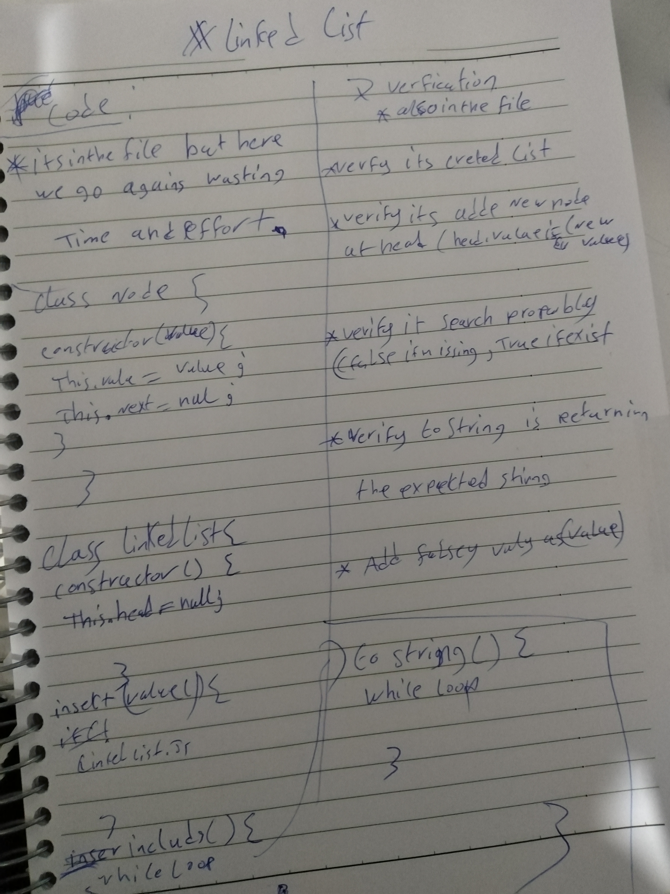

# Singly Linked List
<!-- Short summary or background information -->
Implement a Linked List

## Challenge
<!-- Description of the challenge -->
* [x] Create Node Class that has two properties, a value and pointer to the next Node.
* [x] Create LinkedList Class have a head property and on instantiation create an empty linked list.
* [x]  Create a method called insert that takes a value and inserts it as the head with O(1) time performance
* [x]  Create a method called include which takes a value and returns a boolean of that values existence in the linked list
* [x]  Create a method called toString which returns a string of all the values and  the string formate like; `"{ 1 } -> { 2 } -> { 3 } -> NULL"`

* [x]  Tests
  * [x] Can successfully instantiate an empty linked list
  * [x] Can  `insert` into the linked list
  * [x] The head  will  point to the first node in the linked list
  * [x] Can insert multiple nodes into the linked list at the linked list start .ie (adding new head)
  * [x] Will return true when finding a value within the linked list that exists
  * [x] Will return false when searching for a value in the linked list that does not exist
  * [x] Can properly return a collection of all the values that exist in the linked list

## Approach & Efficiency
<!-- What approach did you take? Why? What is the Big O space/time for this approach? -->

For insert I inserted the value in a new node and made that the head and made the next the old head node if the lest is empty the head would be null and `insert` will create new node and assign it as head .

I traversed -starting from the head - through the linked list using `while()` loop and checked for the `next` in the following methods:

* `includes()` I checked if the value was equal to each `node.value` in the list, if it was I returned true.

 `toString` I created a string and added the head.value, then concatinate each other node value to that string and in the `while` body then concatenate  the `NULL` after its done and return the string. 

## API
<!-- Description of each method publicly available to your Linked List -->

* The insert(value) method inserts a value in the beginning of the list
* The includes(value) traveresed through the list to check the `value`
* toString returns a string of the list values

### WhiteBoard 

