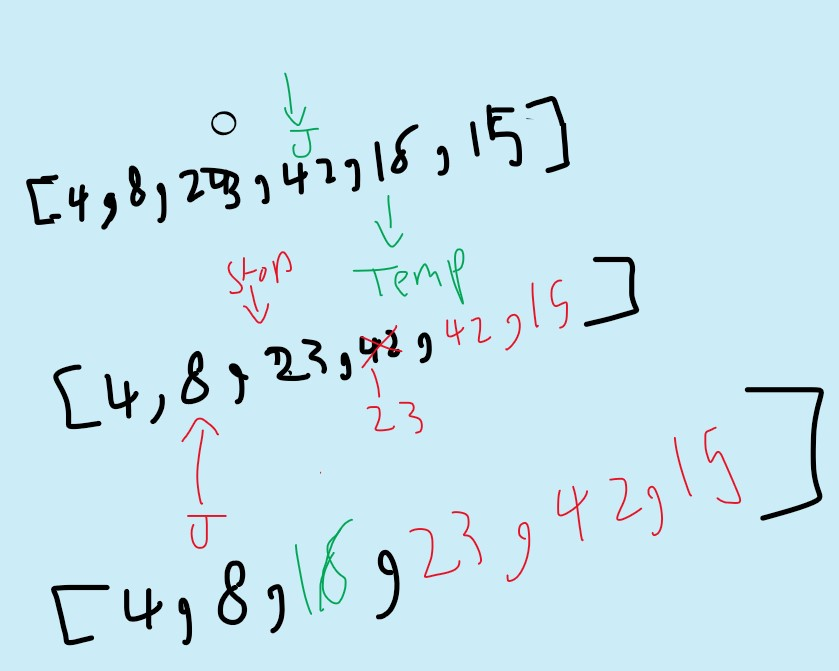

# Insertion Sort

Insertion Sort is a sorting algorithm that traverses the array multiple times as it slowly builds out the sorting sequence. The traversal takes a value from the array and compare it with its predecessor and place it before the values that is bigger than it.

## Pseudocode

```Pseudo-code
InsertionSort(int[] arr)
  
  FOR i = 1 to arr.length
    int j <-- i - 1
    int temp <-- arr[i]
      
    WHILE j >= 0 AND temp < arr[j]
        arr[j + 1] <-- arr[j]
        j <-- j - 1
        
    arr[j + 1] <-- temp

```

## Trace

Sample Array:[8,4,23,42,16,15]

### Pass 1:

1. temp = 4 .


### Pass 2 :

1. it will not iterate over 23 because its bigger than 8.
2. 42 will be the same as 23.

### Pass 3 :

* temp = 16 .


* **and the same goes for 15**.

## Efficiency

* Time: O(n^2)
  * The basic operation of this algorithm is comparison. This will happen n * (n-1) number of times…concluding the algorithm to be n squared.
* Space: O(1)
  * No additional space is being created. This array is being sorted in place…keeping the space at constant O(1).
