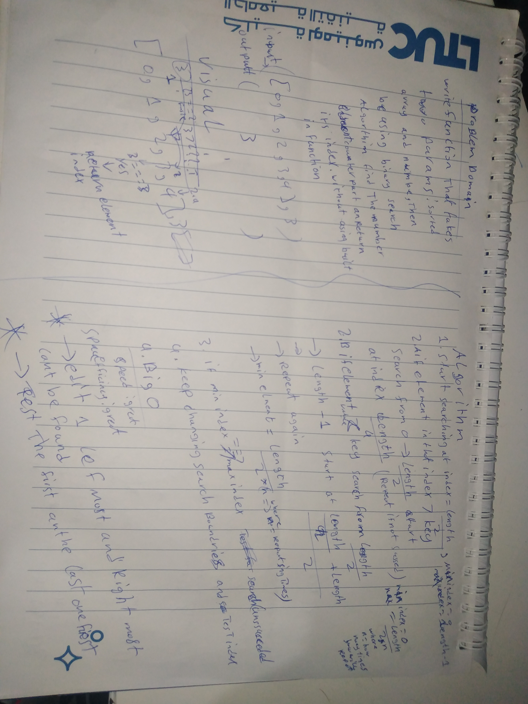
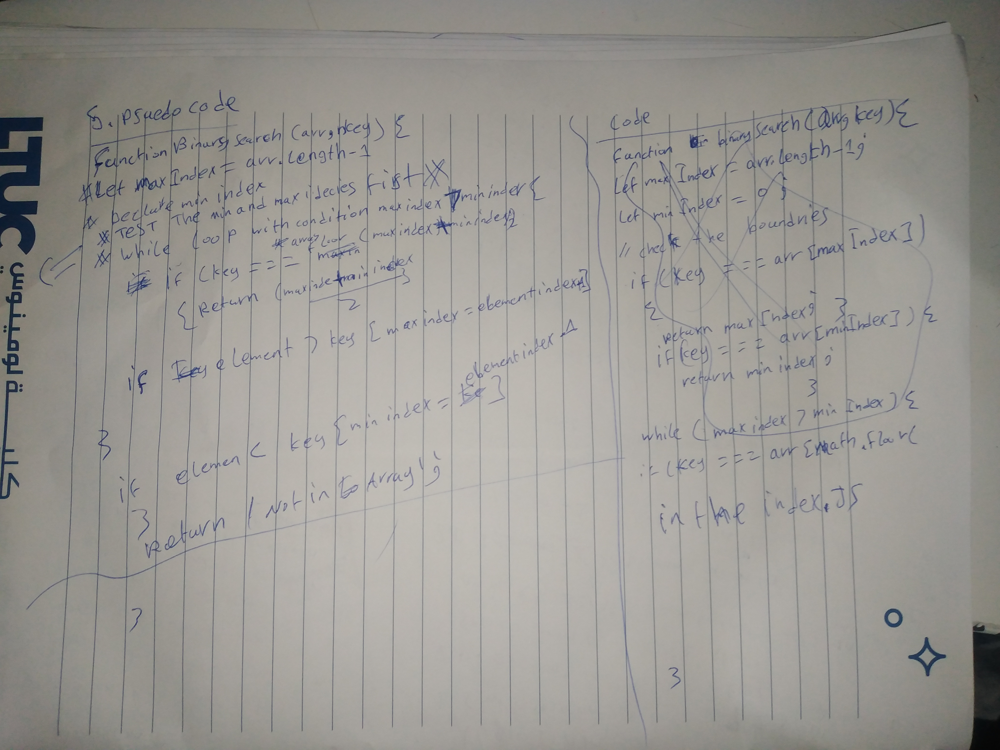

# Summary
<!-- Short summary or background information -->
Return the index of an array for a search key.

## Challenge
<!-- Description of the challenge -->
Write a function called binarySearch that has 2 arguments, a sorted array
and a search key, with built-ins return the index of the array is equal to the searchKey
If the element doesn't exist return -1

## Approach & Efficiency
<!-- What approach did you take? Why? What is the Big O space/time for this approach? -->
search for middle index element , change the search boundary on each iteration , while loop is running and well break if the search failed,

**Attached index.js file**

## Solution
<!-- Embedded whiteboard image -->

