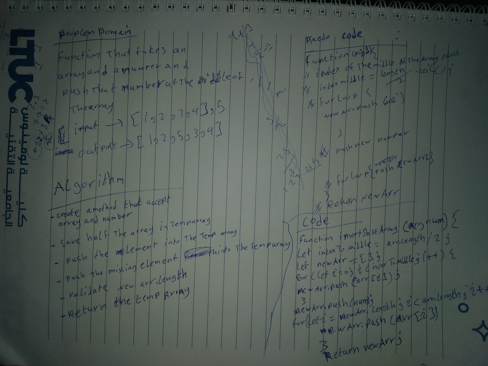

# Reverse an Array
<!-- Short summary or background information -->
Write a function that shift an element into an array , without using a built in function

## Challenge
<!-- Description of the challenge -->
push an element to the middle of an array of any length

## Approach & Efficiency
<!-- What approach did you take? Why? What is the Big O space/time for this approach? -->
Used  2 loops to split the array and push  the element between their executions in an empty array.

## Solution
<!-- Embedded whiteboard image -->

