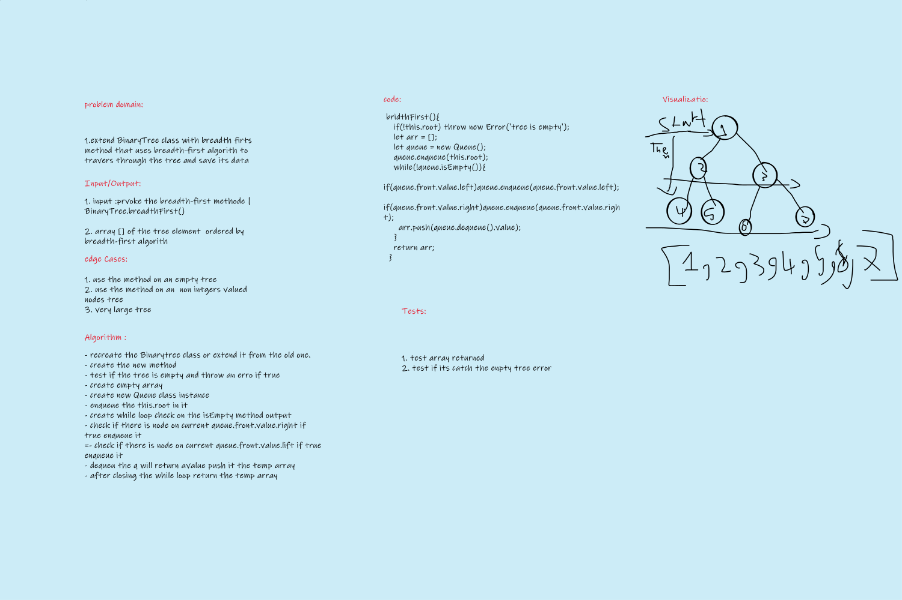

# Challenge Summary
<!-- Description of the challenge -->
extend the BinaryTree class with an extra method 'breadth-first' that traverse throgh the tree using the breadth-first algorithm;

## Whiteboard Process
<!-- Embedded whiteboard image -->

## Approach & Efficiency
<!-- What approach did you take? Why? What is the Big O space/time for this approach? -->
-`breadth-first()` push the branches of the tree in a queue left then right then take the queue front value and push it in array then dequeue it Big O Space/time (n^n)(n^n).

## Challenge

- [X] Top-level README “Table of Contents” is updated
- [x] README for this challenge is complete
       - [X] Summary, Description, Approach & Efficiency, Solution
       - [X] Picture of whiteboard
- [X] Feature tasks for this challenge are completed
- [X] Unit tests written and passing
       - [X] “Happy Path” - Expected outcome
       - [X] Expected failure
