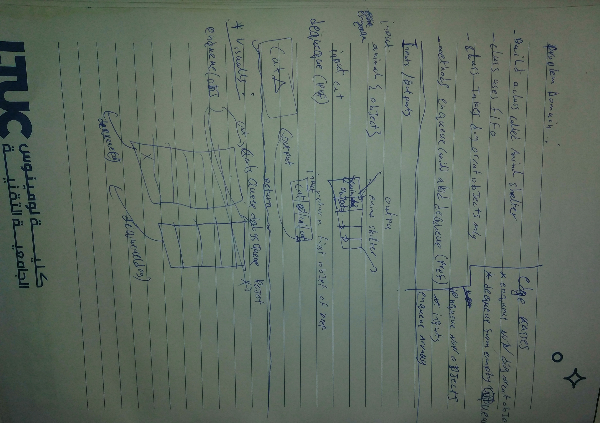

# Challenge Summary
<!-- Description of the challenge -->
building AnimalShelter class that use's FIFO as an adapting protocol,shelter only takes cats and dogs objects.
## Whiteboard Process
<!-- Embedded whiteboard image -->

## Approach & Efficiency
<!-- What approach did you take? Why? What is the Big O space/time for this approach? -->
- created two Queue Class instance
- `enqueue(animal)` see the key `type` value of the sent object and push it to the proper Queue based on that key`animal.type` value .(1)(1)
- `dequque(pref)` read pref and pop one of the queues according to its value ('cat') or ('dog') else it will raise and exception.(1)(n)

## Challenge

- [X] Top-level README “Table of Contents” is updated
- [X] README for this challenge is complete
       - [X] Summary, Description, Approach & Efficiency, Solution
       - [X] Picture of whiteboard
- [X] Feature tasks for this challenge are completed
- [X] Unit tests written and passing
       - [X] “Happy Path” - Expected outcome
       - [X] Expected failure
       - [X] Edge Cases
