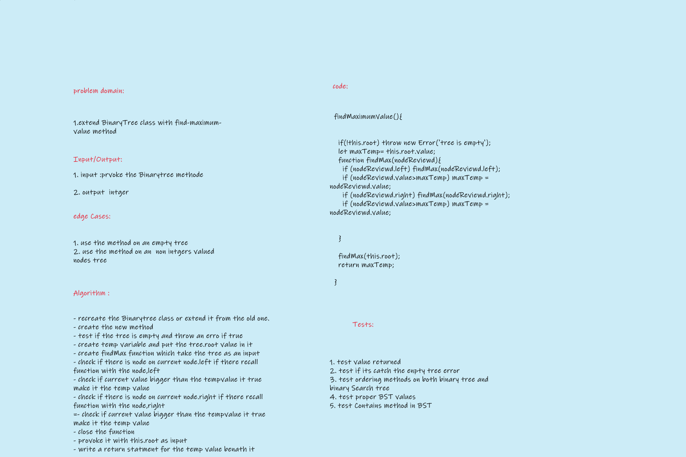

# Challenge Summary
<!-- Description of the challenge -->
extend the BinaryTree class with an extra method 'findMaximumValue' that find the maximum value in the tree `Nodes` `value`;

## Whiteboard Process
<!-- Embedded whiteboard image -->

## Approach & Efficiency
<!-- What approach did you take? Why? What is the Big O space/time for this approach? -->
-`findMaximumValue()` traverse throw tree with a  recursive function and compare `Node` `value` to a temp value and reassign the temp value if true to that `node.value` after all the tree is searched the temp variable value will be returned. Big O Space/time (1)(n).

## Challenge

- [X] Top-level README “Table of Contents” is updated
- [x] README for this challenge is complete
       - [X] Summary, Description, Approach & Efficiency, Solution
       - [X] Picture of whiteboard
- [X] Feature tasks for this challenge are completed
- [X] Unit tests written and passing
       - [X] “Happy Path” - Expected outcome
       - [X] Expected failure
