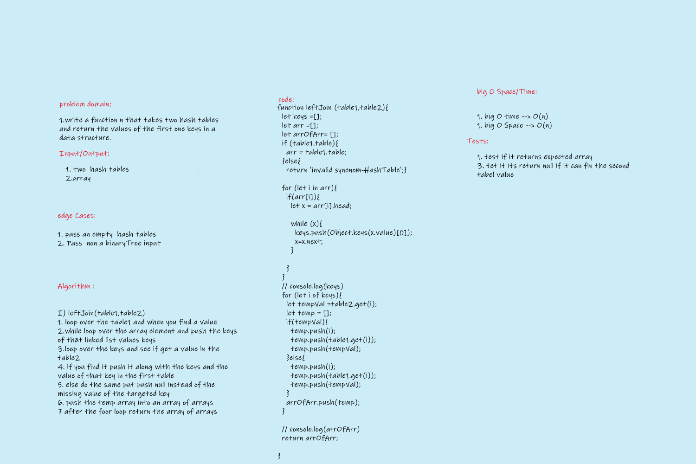

# Challenge Summary
<!-- Description of the challenge -->
write a left join function that takes two hash tables and return the values of the first one keys in a data structure.

## Whiteboard Process
<!-- Embedded whiteboard image -->

## Approach & Efficiency
<!-- What approach did you take? Why? What is the Big O space/time for this approach? -->
- `leftJoin` take the left table and get its keys the search for that key in the other hashtable if you found avalue to that key  save the key and its first table value and its second table value into an array ,if you dont find it do the same pushing but with `null` instead of the second table value then push Big O space/time (n)(n)

## Challenge

- [X] Top-level README “Table of Contents” is updated
- [x] README for this challenge is complete
       - [X] Summary, Description, Approach & Efficiency, Solution
       - [X] Picture of whiteboard
- [X] Feature tasks for this challenge are completed
- [X] Unit tests written and passing
       - [X] “Happy Path” - Expected outcome
