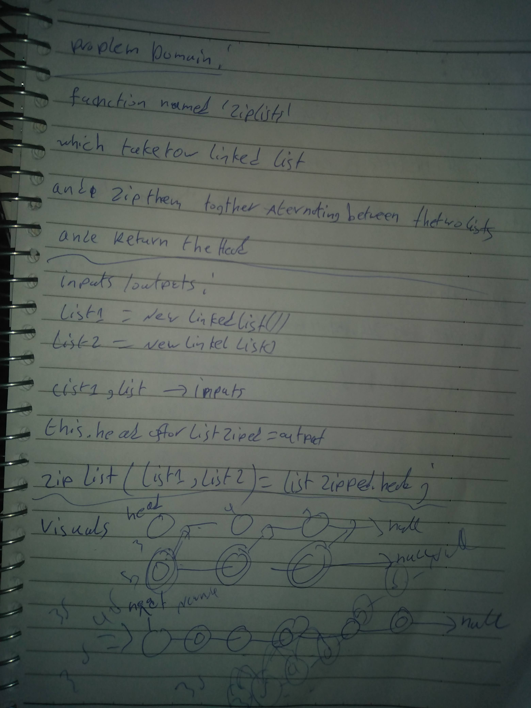

# Challenge Summary
<!-- Description of the challenge -->
add to the linked list methode to extract the kth value from its list.

## Whiteboard Process
<!-- Embedded whiteboard image -->

## Approach & Efficiency
<!-- What approach did you take? Why? What is the Big O space/time for this approach? -->

transverse throgh lists multible times and use the `LL` class methods. BIG O space(1)/ BIG O (time)(n)

## Challenge

- [X] Top-level README “Table of Contents” is updated
- [X] README for this challenge is complete
       - [X] Summary, Description, Approach & Efficiency, Solution
       - [X] Picture of whiteboard
- [X] Feature tasks for this challenge are completed
- [X] Unit tests written and passing
       - [X] “Happy Path” - Expected outcome
       - [] Expected failure
       - [X] Edge Cases
