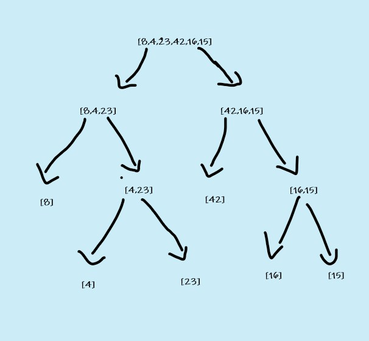
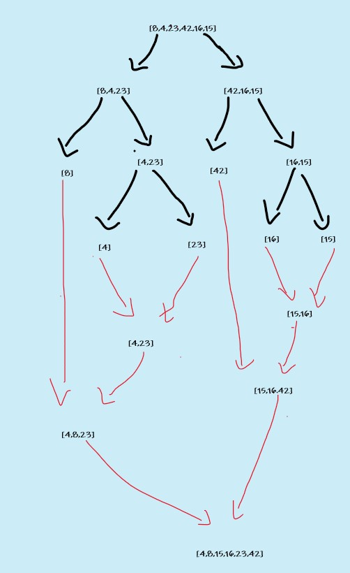

# Merge sort

Insertion Sort is a sorting algorithm divide the array into halfs until it reaches single array then it well recursivly rebuild the area (merge the pieces )and re arrange it while merging .

## Pseudocode

```Pseudo-code

ALGORITHM Mergesort(arr)
    DECLARE n <-- arr.length
           
    if n > 1
      DECLARE mid <-- n/2
      DECLARE left <-- arr[0...mid]
      DECLARE right <-- arr[mid...n]
      // sort the left side
      Mergesort(left)
      // sort the right side
      Mergesort(right)
      // merge the sorted left and right sides together
      Merge(left, right, arr)

ALGORITHM Merge(left, right, arr)
    DECLARE i <-- 0
    DECLARE j <-- 0
    DECLARE k <-- 0

    while i < left.length && j < right.length
        if left[i] <= right[j]
            arr[k] <-- left[i]
            i <-- i + 1
        else
            arr[k] <-- right[j]
            j <-- j + 1
            
        k <-- k + 1

    if i = left.length
       set remaining entries in arr to remaining values in right
    else
       set remaining entries in arr to remaining values in left

```

## Trace

Sample Array:[8,4,23,42,16,15]

### Pass 1:

* destruct the array into single element array using `mergeSort` function



### Pass 2 :

* merge the array while resorting  the elements  these



* **those Functions are done recursively**.

## Efficiency

* Time: O(nLog2n)
  * The basic operation of this algorithm is dividing and merging . This will take nlog2n time to complete.
* Space: O(1)
  *additional space is being created. This array is being sorted in other arrays fragments  the space at linear increase O(n).
