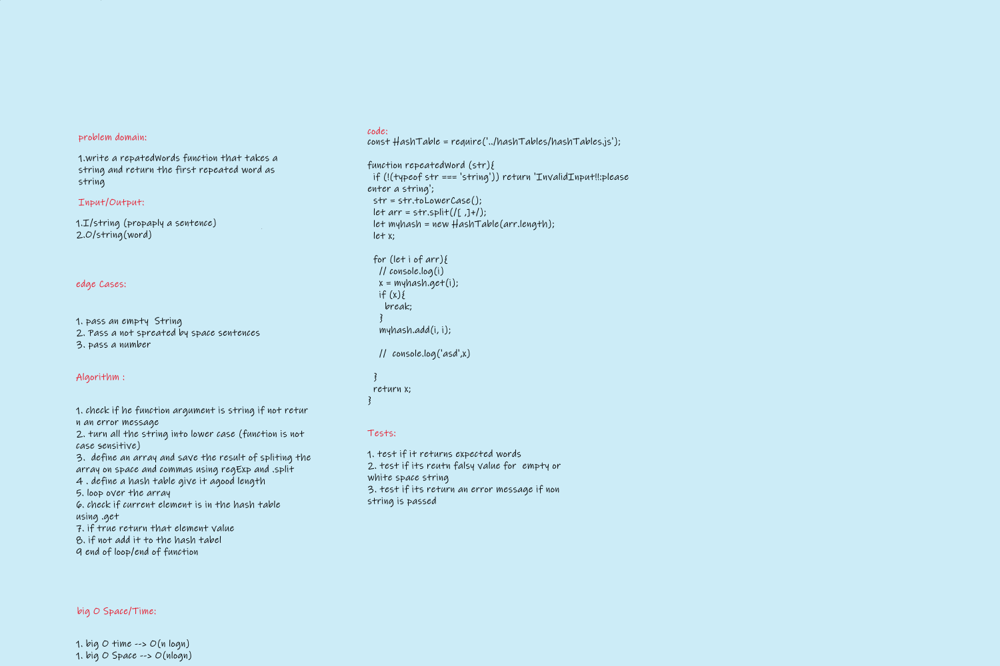

# Challenge Summary
<!-- Description of the challenge -->
write a repeatedWords function that takes a string and return the first repeated word in that string

## Whiteboard Process
<!-- Embedded whiteboard image -->

## Approach & Efficiency
<!-- What approach did you take? Why? What is the Big O space/time for this approach? -->
- `repeatedWords`  create a hash table and see if the silted string  item array is in the table as a key if not add it as a key and a value to the   hashTable.
- `HashTables`  Big O space/time O(nlogn)(nlogn)

## Challenge

- [X] Top-level README “Table of Contents” is updated
- [x] README for this challenge is complete
       - [X] Summary, Description, Approach & Efficiency, Solution
       - [X] Picture of whiteboard
- [X] Feature tasks for this challenge are completed
- [X] Unit tests written and passing
      - [X] “Happy Path” - Expected outcome
      - [X] Expected failure
      - [X] Edge Cases
