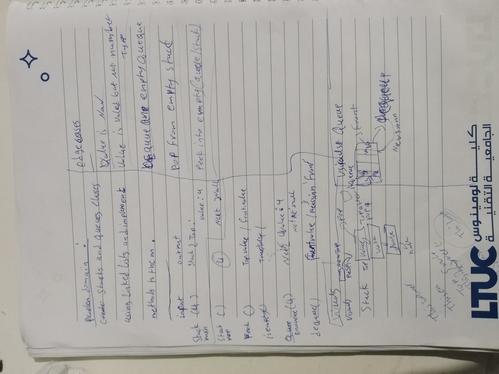
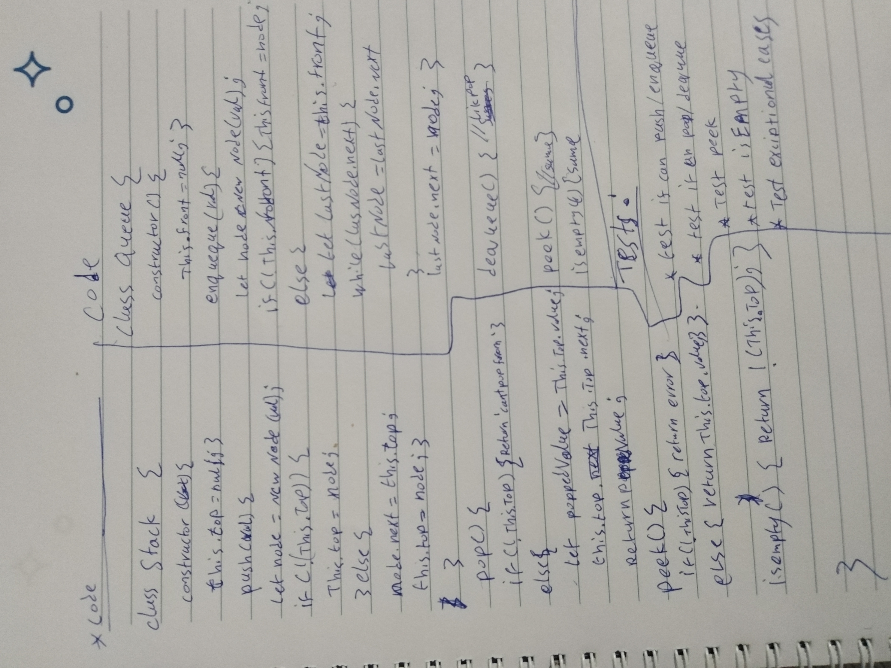

# Challenge Summary
<!-- Description of the challenge -->
building Stack and Queue classes and their methods using Linked list construction 
## Whiteboard Process
<!-- Embedded whiteboard image -->

## Approach & Efficiency
<!-- What approach did you take? Why? What is the Big O space/time for this approach? -->

- `push(val)` create a new node and then push the current `top` to its `next:` and make it the new `this.top` (1)(1).
- `push()` read the value of the  `top`  and make its `next` the new `this.top` then return the value (1)(1).
- `enqueue(val)` traverse through the list then added the new node created at its tail (1)(n)
- `dequque()` same as `push()` but we targeted queue's `front` property (1)(1).
- `peek()` return the value of `this.top`/`this.front` or raise an exception if the stack/queue is empty (1)(1).
- `isEmpty()` return true/false  if the queue/stack is empty/populated (1)(1).

## Challenge

- [X] Top-level README “Table of Contents” is updated
- [X] README for this challenge is complete
       - [X] Summary, Description, Approach & Efficiency, Solution
       - [X] Picture of whiteboard
- [X] Feature tasks for this challenge are completed
- [X] Unit tests written and passing
       - [X] “Happy Path” - Expected outcome
       - [X] Expected failure
       - [X] Edge Cases
